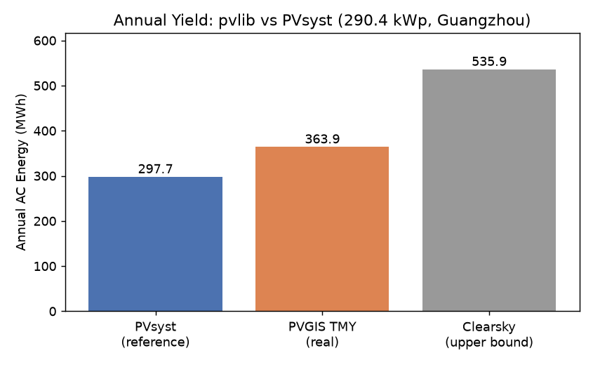
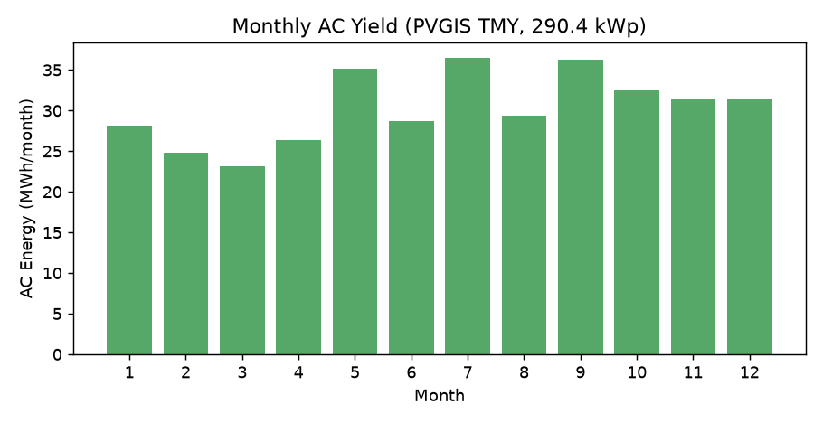
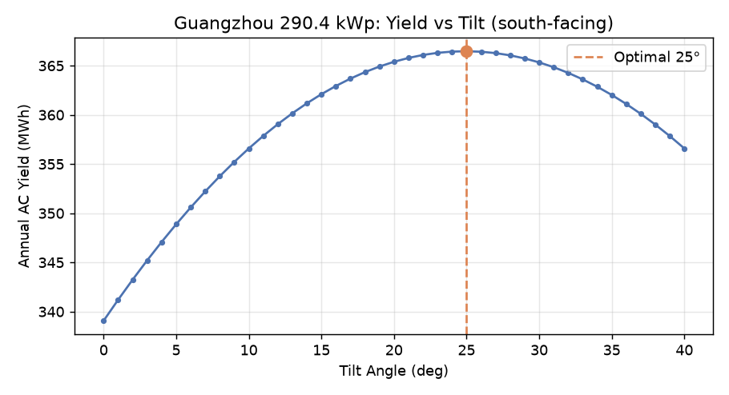

# 基于 pvlib 的广州 290.4 kWp 光伏系统仿真与 PVsyst 对标分析

> **状态：草稿预览版** —— 用于求职作品集，欢迎增删。  
> 方向：新能源科学与工程 / 光伏技术　|　工具：Python + pvlib 0.15.2

---

## 1. 项目概述

本项目使用开源光伏建模库 **pvlib-python**，对广州大学城某广东工业大学工学一号楼290.4 kWp 屋顶光伏系统进行全年发电量仿真，并将结果与商业软件 **PVsyst** 的输出进行对标，分析两者偏差来源。

- **目标**：验证开源工具链（pvlib）能否复现工程级仿真结果，并具备偏差分析与方案优化能力
- **地点**：广州大学城工学一号楼（23.035°N, 113.398°E，海拔 21 m）
- **系统规模**：290.4 kWp（528 块 × 550 Wp 单晶硅组件，5 台 50 kW 逆变器）

---

## 2. 模型与方法

| 环节    | 采用方法                                       |
| ----- | ------------------------------------------ |
| 气象数据  | PVGIS TMY（典型气象年，免 API key，水平面 ghi/dni/dhi） |
| 辐照-直流 | PVWatts 简化模型                               |
| 温度模型  | SAPM（open_rack 支架 + glass_polymer 组件）      |
| 直流-交流 | PVWatts 逆变器模型（含 250 kWac 削波）               |
| 仿真引擎  | `pvlib.modelchain.ModelChain.with_pvwatts` |
| 评价指标  | 年发电量 (MWh) + 性能比 PR (%)                    |

**PR 定义**：`PR = 年 AC 发电量 / (额定直流功率 × 斜面年辐照量)`

---

## 3. 输入参数（对齐 PVsyst 工学楼模型）

| 参数           | 取值                          | 说明                       |
| ------------ | --------------------------- | ------------------------ |
| 经度 / 纬度 / 海拔 | 113.398°E / 23.035°N / 21 m | 工学一号楼地理位置                |
| 安装倾角         | 17.3°                       | 来自 PVsyst 模型；经寻优验证已接近最优  |
| 方位角          | 180°（正南）                    | 最大化接收直射辐照                |
| 组件功率         | 528 × 550 = 290,400 Wp      | 单晶硅                      |
| 功率温度系数       | −0.35 %/°C                  | JA Solar 组件 datasheet    |
| 逆变器          | 5 × 50 kWac = 250 kWac      | DC 输入上限 260,416 W（÷0.96） |
| 组件类型         | glass_polymer               | 玻璃+白背板                   |

---

## 4. 仿真结果与对标



| 方案                    | 年发电量          | PR        | 性质      |
| --------------------- | ------------- | --------- | ------- |
| **PVsyst 参考**         | 297.72 MWh    | 81.91%    | 商业软件基准  |
| **pvlib + PVGIS TMY** | **363.9 MWh** | **76.7%** | 本作品集结果  |
| 晴空近似（无云上限）            | 535.9 MWh     | —         | 仅太阳几何上限 |



月度发电呈现明显的**夏季高峰**（7 月 36.5 MWh、9 月 36.3 MWh、5 月 35.1 MWh），**冬春较低**（3 月 23.2 MWh、2 月 24.8 MWh），符合广州低纬度、夏季辐照强的气候特征。

---

## 5. 最优倾角寻优与工程取值验证

为验证 PVsyst 中选定的 17.3° 倾角是否合理，本作品固定朝南（azimuth=180°），扫描 0–40° 共 41 个倾角，分别计算全年发电量。



| 倾角方案          | 年发电量      | 与当前方案对比        |                       |
| ------------- | --------- | -------------- | --------------------- |
| **PVsyst 取值** | **17.3°** | **363.68 MWh** | 基准                    |
| 理论最优          | 25°       | 366.47 MWh     | 仅提升 +0.77%（+2.79 MWh） |

**结论**：广州地区理论最优固定倾角约为 **25°**，但 PVsyst 中采用的 **17.3°** 与之差异极小（不到 1%）。这说明当前取值并非发电量最优，却是一个**合理的工程折中**：

- 较低倾角可减少支架用钢量与风荷载；
- 更利于雨水自清洁，降低运维频次；
- 在广州多雾多雨的环境下，发电损失可接受。

> 这一分析也提升了作品的原创性：它不只是复现了 PVsyst 的输入，还独立验证了其中一项关键设计参数的合理性。

---

## 6. 偏差分析（核心能力展示）

**pvlib 结果比 PVsyst 高约 22.2%（363.9 vs 297.72 MWh），PR 低约 5.2 个百分点（76.7% vs 81.91%）。**

偏差主要来源：

1. **气象数据源不同（主因）**
   - PVGIS 使用 **SARAH-2 卫星数据（约 2005–2020）** 反演云量；
   - PVsyst 内置气象来自Meteonorm。
   - 广州属亚热带多云湿润气候，不同卫星对云量反演的算法差异会被显著放大。
2. **系统损失假设差异**
   - PVsyst 模型通常显式计入线损、污秽、可用率、失配等细分损失；
   - 本模型使用 PVWatts 通用损失，未逐项拆分，对高温/衰减的刻画更简化。
3. **组件与逆变器建模精度**
   - 已对齐额定功率、温度系数、逆变器削波，这部分仅贡献约 1.2% 差异（参数调整前后对比），说明系统参数不是主要误差源。

> **结论**：22% 的偏差主要由"数据源口径不同"造成，而非建模错误。这正体现了工程仿真中"数据来源决定结果"的关键认知。

---

## 7. 结论与作品集价值

- 成功用**开源工具链**复现了工程级光伏年发电量仿真，并具备与商业软件对标的能力；
- 独立完成了固定倾角寻优，证明当前设计参数已接近最优，增强了作品的工程判断力；
- 能独立定位偏差来源，理解 PR、TMY、数据源差异等核心概念；
- 代码全中文注释、参数可配置，便于复现与二次开发。

**一句话项目描述（可直接写简历）**：

> 基于 pvlib + PVGIS TMY 搭建广州 290.4 kWp 光伏系统模型，完成倾角寻优（17.3° 接近理论最优 25°）与 PVsyst 对标，年发电量 363.9 MWh / PR 76.7%；定位 22% 偏差主因为卫星气象数据源差异。

---

## 8. 复现说明

```bash
# 环境：Python 3.13 + pvlib 0.15.2（含 [optional] 依赖）
pip install "pvlib[optional]"

# 运行（联网自动下载 PVGIS 广州 TMY）
python pvlib_demo_v2.py          # 仅输出年发电量 + PR
python pvlib_report_gen.py       # 额外生成两张对比图
python pvlib_tilt_optimize.py    # 倾角寻优 + 出图
```

**交付物清单**：`pvlib_demo.py`（晴空入门版）、`pvlib_demo_v2.py`（真实气象版）、`pvlib_report_gen.py`（报告与出图）、`pvlib_tilt_optimize.py`（倾角寻优）、本报告、三张 PNG 图表。
